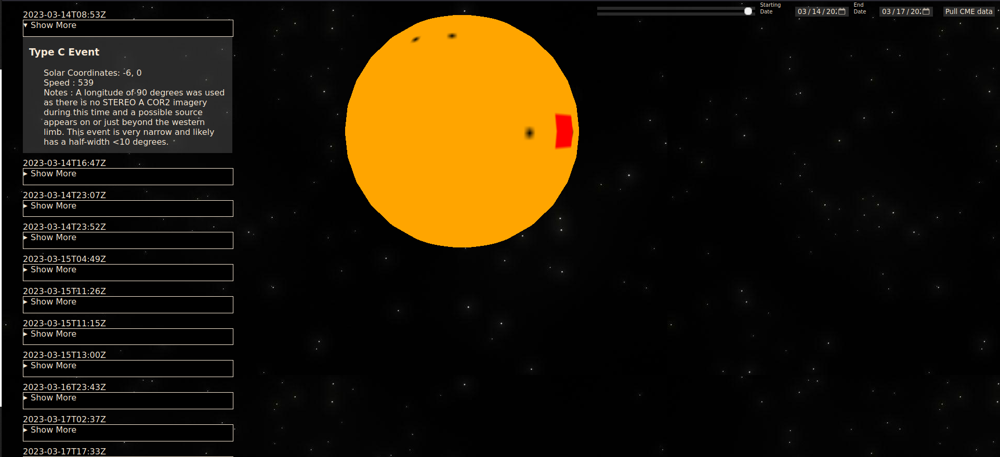

# Coronal Mass Ejection Event Mapping

## Capture Coronal Mass Ejections using NASA's DONKI API

### https://jordan-carlson99.github.io/frontend-project/

### Dependencies:

- API:
  - *https://api.nasa.gov/*
- Libraries:
  - *https://p5js.org/*
  - *https://jquery.com/*

## Features

- Adjustable start and end date
- P5 powered 3-d rendering of sun with translated solar coordinates that indicate where the event took place
- CME catalogue that displays
  - CME structure class
  - Solar Coordinates
  - Measured Speed
  - Applicable Notes

---

## Using this project:

To access the web app simply go to the site listed below the title in the readme.

Access to the API is throttled top 30 requests an hour when using a guest key, to request a key visit the api link in the dependencies sectipn of the readme. Once you've recieved your key (typically instant) go to app.js and paste it into the key variable on line 0

## Design:

The structure of the application is held in app.js.
Flow of data is as follows :

1. The preload function is called by the p5 library linked in index.html, where p5's loadJSON handles the asyncronous nature of the response data.
2. p5 then calls setup which creates a 500\*500 WEBGL canvas and appends it to the page, and then calls the main function with the retrieved data from preload
3. main hands the data off to the function dataParse. Here the data is reduced down to an array named coords that includes the coordinates, time, speed, type, and notes. coords is pushed into another array that gets returned to the main function. Before the data is returned, the program appaends the catalogue items for each CME to the page.
4. main hands the data off to the mapPoints function. This function creates a canvas then transalates the solar coordinates using x=(map width / 360) _ (180 + latitude) and y=(map height / 180) _ (90 - longitude). This method is was verified by plotting the prime meridian on the array and passing 0,0 into the function.
5. mapPoints hands off the plotted canvas to canvasSaver which uses the toDataUrl method to convert it to a .png file and updating the variable "img" which p5 checks 60 times a second in the draw function to render our sun
